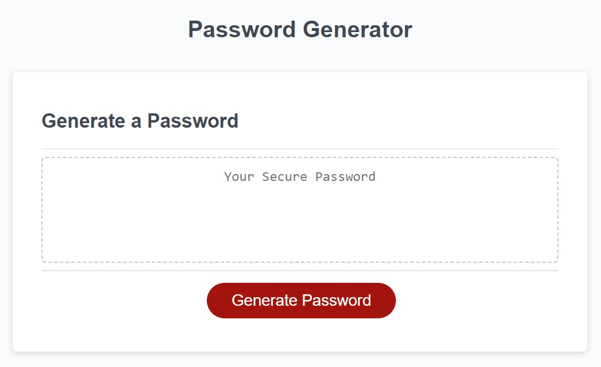
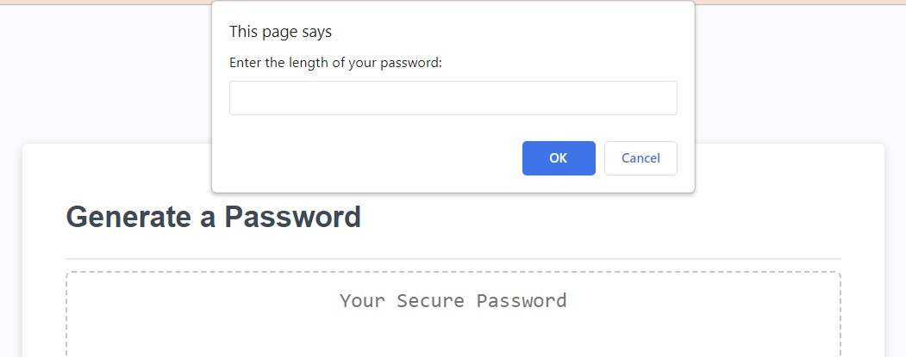
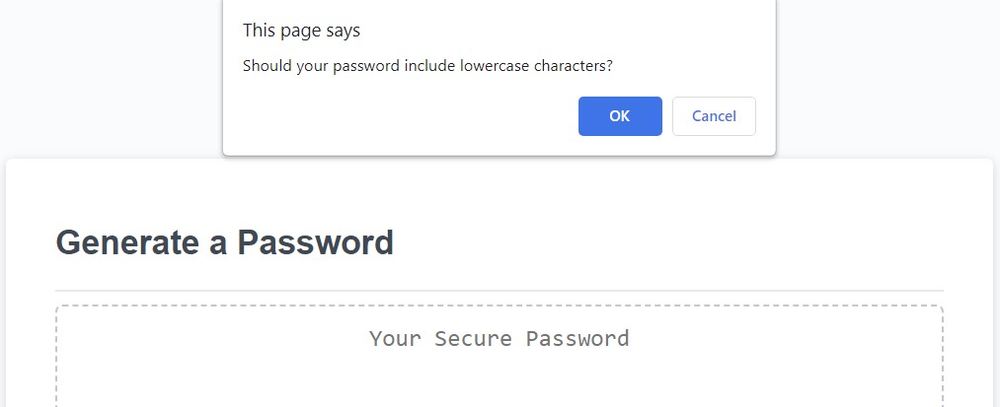
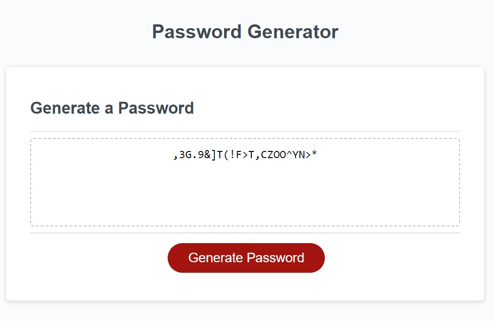

# Password Generator

## Description

The aim of this project was to create a secure password generator based on the criteria chosen by the user. The user can choose the length between 8 and 128 characters and the type of characters, such as uppercase letters, lowercase letters, numbers, and/or symbols. This application will allow users to generate strong and secure passwords for their use.
Working on this project, I learned how to bulid functions in JavaScript that not only collect inputs, but also validate the answers, and allow us to communicate with the user.

## Installation

n/a

## Usage

A user can press the red "Generate Password" button and will be prompted to choose the length for their password. If the input will be shorter than 8 and longer than 128 characters, and if it will include characters other than numbers, the user will be asked to enter a valid length. Next, the user will be prompted to choose at least one of the following options for the characters type: uppercase letters, lowercase letters, numbers, and symbols. If none of the types will be chosen, an alert will appear asking to choose at least one type. Finally, the generated password will be shown in the main text field.
https://lmintsys.github.io/password-generator/

## Credits

Luba Mintsys. https://github.com/lmintsys

## License

MIT License

Copyright (c) 2023 lmintsys

Permission is hereby granted, free of charge, to any person obtaining a copy
of this software and associated documentation files (the "Software"), to deal
in the Software without restriction, including without limitation the rights
to use, copy, modify, merge, publish, distribute, sublicense, and/or sell
copies of the Software, and to permit persons to whom the Software is
furnished to do so, subject to the following conditions:

The above copyright notice and this permission notice shall be included in all
copies or substantial portions of the Software.

THE SOFTWARE IS PROVIDED "AS IS", WITHOUT WARRANTY OF ANY KIND, EXPRESS OR
IMPLIED, INCLUDING BUT NOT LIMITED TO THE WARRANTIES OF MERCHANTABILITY,
FITNESS FOR A PARTICULAR PURPOSE AND NONINFRINGEMENT. IN NO EVENT SHALL THE
AUTHORS OR COPYRIGHT HOLDERS BE LIABLE FOR ANY CLAIM, DAMAGES OR OTHER
LIABILITY, WHETHER IN AN ACTION OF CONTRACT, TORT OR OTHERWISE, ARISING FROM,
OUT OF OR IN CONNECTION WITH THE SOFTWARE OR THE USE OR OTHER DEALINGS IN THE
SOFTWARE.
